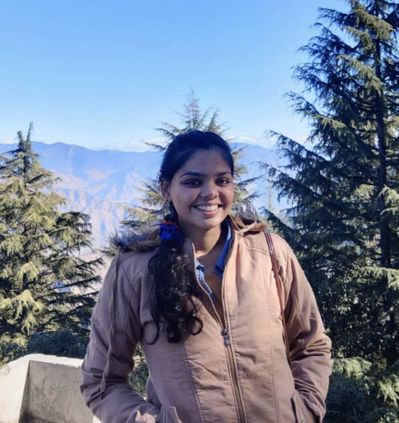

<!-- Profile Header -->

  

    
    <h3 style="font-size: 24px; margin: 0;">
      👋 Hi there!
    </h3>
  

  
I'm <strong>Shreshtha Modi</strong>, a Machine Learning student at DAIICT.

  

    I work at the intersection of 
    <strong>Machine Learning/NLP</strong>, 
    <strong>Optimization</strong>, and 
    <strong>Randomized Numerical Linear Algebra</strong>.
    I'm interested in building solutions that make real-world impact, particularly for
    <strong>poverty</strong> and
    <strong>child labour</strong>.
  

  

    When I'm not coding or studying, you’ll find me 
    <strong>reading fiction</strong>, 
    <strong>binge-watching the latest internet microtrends</strong>, or
    <strong>playing chess</strong>.
  

  <!-- Socials: plain text links that adapt to the active palette -->
  <nav class="socials">
    <a href="mailto:modishreshtha48@gmail.com">email</a>
    <a href="https://linkedin.com/in/shreshthamodi" target="_blank">linkedin</a>
    <a href="https://github.com/shreshtha48" target="_blank">github</a>
    <a href="https://www.kaggle.com/shreshthamodi" target="_blank">kaggle</a>
    <a href="https://shreshtha.hashnode.dev/" target="_blank">blog</a>
  </nav>

<!-- Wave animation -->
<style>
  .wave {
    display: inline-block;
    animation: wave 2s infinite;
    transform-origin: 70% 70%;
  }

  @keyframes wave {
    0% { transform: rotate(0deg); }
    10% { transform: rotate(14deg); }
    20% { transform: rotate(-8deg); }
    30% { transform: rotate(14deg); }
    40% { transform: rotate(-4deg); }
    50% { transform: rotate(10deg); }
    60% {
